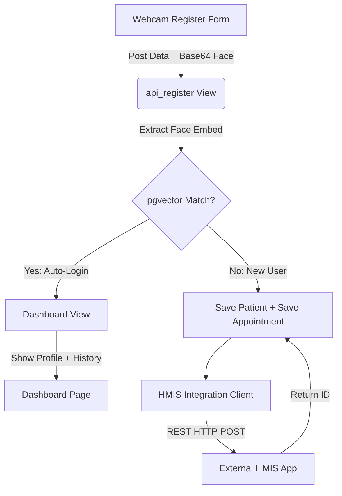

# HMIS Integration & Appointment System Planning

This document details the architecture, design, and step-by-step implementation plan to extend the face-recognition login system with a **Patient Appointment booking system** and **external HMIS (Hospital Management Information System) integration**.

---

## Technical Overview

1. **User Registration Form & Fields**:
   - Gather more patient information during face registration: **Gender**, **Address**, and **Phone/Mobile**.
   - Take the patient's initial **Doctor Appointment** preference.
   - Default the appointment **Date** to today's date (`timezone.now().date()`) and capture the current schedule **Time** (or let them pick/confirm).
2. **Database Models Schema**:
   - Extend the `FaceUser` model to store the extra demographic fields.
   - Create a `Doctor` model to store doctor directories and their specializations.
   - Create an `Appointment` model to store all current and past appointment records.
3. **External HMIS API Client**:
   - Implement an external API integration in `accounts/hmis_client.py` using Python `requests` with robust timeouts, error-logging, and a mock/sandbox fallback so development and testing can proceed seamlessly.
   - When a user successfully registers, the system triggers the HMIS synchronization.
4. **Dashboard View & History**:
   - After a patient successfully logs in via face matching, they are redirected to the Dashboard.
   - The dashboard will show their full **Patient Profile Info** (Name, DOB, Mobile, Gender, Address) and a new styled card showing **Appointment History** (Doctor, Date, Time, Sync Status, and Action buttons).

---

## User Review Required

> [!IMPORTANT]
> **API Structure & Authentication:**
> Since the external HMIS application API endpoint is not specified yet, we will construct a robust HTTP Client `HMISClient` inside `accounts/hmis_client.py` that utilizes settings like `HMIS_API_URL` and `HMIS_API_KEY`. By default, it will operate in a **Mock/Sandbox Mode** which logs the JSON payload to the console and simulates a successful connection.
>
> Please confirm if your external HMIS expects **REST JSON**, **HL7 FHIR**, or another payload protocol so we can configure the client parameters accordingly.

> [!TIP]
> **Doctor List Source:**
> In our initial plan, we will create a Django model `Doctor` and load a list of mock doctors (e.g., General Medicine, Cardiologist, Pediatrician, etc.) during setup. In production, we can configure our system to automatically pull the active Doctor list directly from the HMIS system via a cron task or an API request!

---

## Open Questions

> [!WARNING]
> 1. **Date & Time constraint:** For the initial appointment booking, should the system allow booking only for *today's current date*, or can patients select *future dates* as well?
> 2. **HMIS Sync Mode:** Should the data be sent to the HMIS synchronously during registration (meaning if the HMIS is offline, registration waits/fails) OR asynchronously (registered immediately, and synced in the background using a status field `hmis_status="pending"`)? We highly recommend **Asynchronous Sync** or a **graceful fallback** so that patients can register even if the HMIS is temporarily down!

---

## Proposed Changes



### 1. Database Layer (Models)

#### [MODIFY] [models.py](file:///c:/Users/devan/OneDrive/Desktop/facelogin/accounts/models.py)
* Add demographic fields to the `FaceUser` model:
  ```python
  GENDER_CHOICES = [
      ('Male', 'Male'),
      ('Female', 'Female'),
      ('Other', 'Other'),
  ]
  gender = models.CharField(max_length=10, choices=GENDER_CHOICES, blank=True, null=True)
  address = models.TextField(blank=True, null=True)
  ```
* Define a new `Doctor` model:
  ```python
  class Doctor(models.Model):
      name = models.CharField(max_length=150)
      specialization = models.CharField(max_length=150)
      room_no = models.CharField(max_length=50, blank=True, null=True)
      is_active = models.BooleanField(default=True)
      
      def __str__(self):
          return f"{self.name} ({self.specialization})"
  ```
* Define a new `Appointment` model:
  ```python
  class Appointment(models.Model):
      SYNC_STATUS = [
          ('pending', 'Pending Sync'),
          ('synced', 'Synced to HMIS'),
          ('failed', 'Sync Failed'),
      ]
      user = models.ForeignKey(FaceUser, on_delete=models.CASCADE, related_name='appointments')
      doctor = models.ForeignKey(Doctor, on_delete=models.CASCADE, related_name='appointments')
      appointment_date = models.DateField()
      appointment_time = models.TimeField()
      hmis_status = models.CharField(max_length=20, choices=SYNC_STATUS, default='pending')
      hmis_patient_id = models.CharField(max_length=100, blank=True, null=True)
      hmis_appointment_id = models.CharField(max_length=100, blank=True, null=True)
      created_at = models.DateTimeField(auto_now_add=True)

      class Meta:
          ordering = ['-appointment_date', '-appointment_time']
          
      def __str__(self):
          return f"{self.user.name} - Dr. {self.doctor.name} on {self.appointment_date}"
  ```

---

### 2. External Integration Service

#### [NEW] [hmis_client.py](file:///c:/Users/devan/OneDrive/Desktop/facelogin/accounts/hmis_client.py)
* Implements the API communication class `HMISClient`.
* Formulates JSON payload with patient profile information + scheduled appointment.
* Handles exception catcher blocks to log errors gracefully, retry logic, and sets a status value depending on whether the mock server is targeted.

---

### 3. Backend Controllers (Views & URLs)

#### [MODIFY] [views.py](file:///c:/Users/devan/OneDrive/Desktop/facelogin/accounts/views.py)
* `register_page`: Pass lists of active doctors to populate the registration form's doctor selection drop-down menu.
* `api_register`:
  - Fetch new request body fields: `gender`, `address`, `doctor_id`, `appointment_date`, `appointment_time`.
  - Validate and create `FaceUser` with these new fields.
  - Create the initial `Appointment` object.
  - Run the `HMISClient.sync_patient_and_appointment` routine in a background thread or synchronously with fail-safe blocks to avoid slowing down registration.
* `dashboard_page`: Retrieve all corresponding appointments for the logged-in user and pass them to the template context directory:
  ```python
  appointments = user.appointments.all()
  ```

---

### 4. User Interface Templates & Scripts

#### [MODIFY] [register.html](file:///c:/Users/devan/OneDrive/Desktop/facelogin/templates/register.html)
* Add styled fields for **Gender** (Radio buttons/Select dropdown) and **Address** (Textarea field).
* Add appointment selection section: **Choose Doctor** (populated from doctor queryset list) and **Date & Time picker** (defaulted to current date/time).

#### [MODIFY] [register.js](file:///c:/Users/devan/OneDrive/Desktop/facelogin/static/js/register.js)
* Read the newly added elements (`reg-gender`, `reg-address`, `reg-doctor`, `reg-app-date`, `reg-app-time`) and bundle them in the payload object submitted via fetch.

#### [MODIFY] [dashboard.html](file:///c:/Users/devan/OneDrive/Desktop/facelogin/templates/dashboard.html)
* Expand the **Profile Details** block with icons showing gender, address, phone.
* Create a premium appointment display block next to or under the login history:
  - Table displaying: Doctor Name, Specialization, Date, Time, Status (synced/pending), and a "Sync Status Badge" styled with standard dark glassmorphism effects.

---

## Verification Plan

### Automated Tests
* Create unit tests in `accounts/tests.py` verifying:
  - Successful user creation with the extended data structures.
  - Fail-safe checks during the external API sync.
  - Appointment queryset lists returned correctly.

### Manual Verification
1. Run docker database migrations inside container using manage.py.
2. Seed the list of doctors using a customized django management script or via Django Admin panel.
3. Open `http://localhost:8000/register/`, input demographic credentials, select a Doctor, scan the face, and click Register.
4. Verify console logs showing the generated HMIS JSON integration payload.
5. Log in with face authentication at `http://localhost:8000/login/`, and confirm that the user lands on the dashboard containing:
   - Full demographic info.
   - The correct history of booked appointments with accurate sync status badges.
